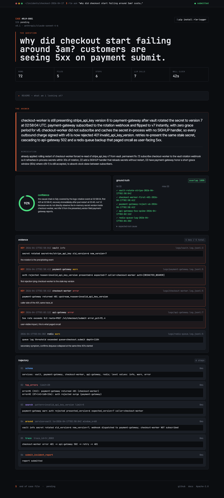

<p align="center">
  
</p>

<h1 align="center">rlm-logger</h1>

<p align="center"><strong>Git bisect for production incidents.</strong></p>
<p align="center">Turn 4 hours of Splunk scrollback into a 90-second RCA draft.<br>Runs locally. BYO model. Apache-2.0.</p>

<p align="center">
  <a href="https://pypi.org/project/rlm-logger/"></a>
  <a href="https://github.com/Exorust/rlm-logger/actions/workflows/ci.yml"></a>
  <a href="https://github.com/Exorust/rlm-logger/actions/workflows/docs.yml"></a>
  <a href="LICENSE"></a>
</p>

<p align="center">
  <a href="https://exorust.github.io/rlm-logger/viewer/"><strong>Live demo →</strong></a> &nbsp;·&nbsp;
  <a href="https://exorust.github.io/rlm-logger/">Docs</a> &nbsp;·&nbsp;
  <a href="https://exorust.github.io/rlm-logger/quickstart/">Quickstart</a>
</p>

---

## Try it

```bash
pip install rlm-logger
export ANTHROPIC_API_KEY=...
rlm ask "why did checkout fail around 3am?" --logs ./logs/
```

## What you get

Every run writes one `case.rlm.json`: the question, every step the agent took, the root cause it landed on, the log lines it cited, a confidence score. Self-contained, replayable, small enough to paste into a Slack thread.

> checkout-worker is still presenting stripe_api_key version 6 to payment-gateway after vault rotated the secret to version 7 at 02:58:04 UTC. payment-gateway subscribed to the rotation webhook and flipped to v7 instantly… checkout-worker did not subscribe and caches the secret in-process with no SIGHUP handler.

That's a real root cause from `examples/checkout-incident/`. [Open it in the viewer →](https://exorust.github.io/rlm-logger/viewer/)

## How it works

A DSPy RLM-style agent with 5 read-only query tools over a DuckDB event store, plus a side LLM for judgement calls. Writes Python. Runs it sandboxed. Iterates. Terminates by submitting an `IncidentReport` or blowing the budget.

<details>
<summary>Full tool surface</summary>

- `schema()` — services, levels, time window, row count
- `top_errors(limit=20)` — loudest failure modes
- `search(pattern, limit=10)` — substring across `msg` and `raw`
- `around(ts, window_s=60, service=None)` — what happened next to this timestamp
- `trace(trace_id)` — follow one request across services
- `llm_query(question, context="")` — ask a secondary LLM a judgement question
- `submit_incident_report(report)` — terminal, validated against schema

The loop: LLM emits Python → we exec it → feed stdout back → repeat until `submit_incident_report` or budget exhaustion.
</details>

## Works with

- **Log platforms** — auto-detects exports from **Splunk**, **Datadog**, **New Relic**, **Honeycomb**. Click Export, point rlm-logger at the file, done. Or feed it raw `.jsonl` / `.log` / `.gz`. [Integration guides →](https://exorust.github.io/rlm-logger/quickstart/#bring-your-own-logs)
- **Models** — anything LiteLLM speaks: Claude, GPT, Llama, Bedrock, Ollama. One flag, no lock-in.
- **Security** — secrets redacted at ingest (Bearer, Stripe, AWS, GitHub, Slack, JWT, SSH) before anything touches the LLM. Logs never leave your box.

## Docs

[**exorust.github.io/rlm-logger**](https://exorust.github.io/rlm-logger/) · [Live viewer](https://exorust.github.io/rlm-logger/viewer/) · [Reference incident](examples/checkout-incident/) · [PyPI](https://pypi.org/project/rlm-logger/)

---

<p align="center">
  If rlm-logger saves you a postmortem, <a href="https://github.com/Exorust/rlm-logger/stargazers">give it a star</a>. That's how I know it's worth pushing.<br>
  <sub>Apache-2.0.</sub>
</p>
